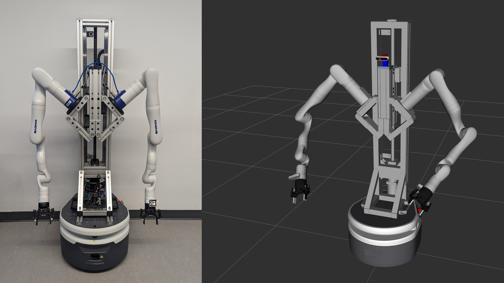

# Gopher-ROS

WPI HIRO Lab Gopher nursing robot ROS packages. This nursing robot comprises Fetch freight robot base, Kinova robot arms, and a self-designed motorized chest with multiple Realsense cameras.

This package mainly provides instruction of setting up ROS packages for Gopher. It assumes that all robot components are connected to the base computer. Also, the repository provides a quick access to all the URDF and 3D model files of the robot components.

<p align="center">
  
</p>

## Dependencies

This repository has been developed and tested in Ubuntu 20.04 and ROS Noetic.

- Freight base is supported by [fetch_ros](https://github.com/fetchrobotics/fetch_ros) package. To use the base, it does not need any additional installation, as all the necessary packages are already installed in the base computer.

  - The desciption file of the base is provided in `fetch_descirption` in the repository.

- Kinova robot arms are provided by the official Kortex ROS package [ros_kortex](https://github.com/Kinovarobotics/ros_kortex). 
  
  - Clone this: https://github.com/Kinovarobotics/ros_kortex and install it following the instructions of the website, or install it following the commands below:
    
    ```
    sudo apt install python3 python3-pip
    sudo python3 -m pip install conan
    conan config set general.revisions_enabled=1
    conan profile new default --detect > /dev/null
    conan profile update settings.compiler.libcxx=libstdc++11 default
    mkdir -p catkin_workspace/src
    cd catkin_workspace/src
    rosdep install --from-paths src --ignore-src -y
    ```

  - As all the description files of the arms are provided in the Kortex ROS package, these files are not included here. However, a modified `kortex_robot.xacro` file is included and used for mounting the arms to the robot chest

- Realsense camera is supported by `realsense2_camera` in [realsense-ros](https://github.com/IntelRealSense/realsense-ros).
  
  - Install it by `sudo apt-get install ros-noetic-realsense2-camera`.
  
  - For `realsense2_description`, a simplified version of Realsense d435 model is included in this repository.

- Motorized chest ROS files are provided by [gopher_ros_clearcore](https://github.com/AlfaKeNTAvR/gopher_ros_clearcore).

  - Clone this: https://github.com/AlfaKeNTAvR/gopher_ros_clearcore and install it following the instructions of the website, or install it following the commands below:
    
    ```
    mkdir -p catkin_workspace/src
    cd catkin_workspace/src
    git clone https://github.com/AlfaKeNTAvR/gopher_ros.git
    cd ../
    sudo apt-get update
    rosdep update
    rosdep install --from-paths src --ignore-src -y
    ```

  - The description files of the chest are included in `stand_chest_description` of this repository.


## View Models

To view the robots in Rviz, run

`roslaunch gopher_desciption view_model.launch robot:=gopher`

Avaliable options are: `gopher`, `gopher_old`, `gopher_presence`, `freight`, and `kinova`.
