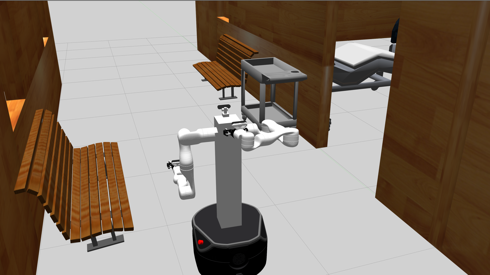

# Gopher-Nurse-Robot
WPI HIRO Lab Gopher-Nurse-Robot ROS packages. This nursing robot comprises the Intel realsense cameras, Kinova robot arms and Fetch freight robot base.



## Dependencies
This repository has been developed and tested in Ubuntu 18.04 and ROS Melodic only. Other version may work but it is not guaranteed.

- Kinova robot arms are provided by the official Kortex ROS package `ros_kortex`. 
  
  - Clone this: https://github.com/Kinovarobotics/ros_kortex and install it following the instructions of the website or commands below:
    
    ```
    sudo apt install python3 python3-pip
    sudo python3 -m pip install conan
    conan config set general.revisions_enabled=1
    conan profile new default --detect > /dev/null
    conan profile update settings.compiler.libcxx=libstdc++11 default
    mkdir -p catkin_workspace/src
    cd catkin_workspace/src
    git clone https://github.com/Kinovarobotics/ros_kortex.git
    cd ../
    rosdep install --from-paths src --ignore-src -y
    ```
  
- `realsense2_camera` and its plug-in `realsense_gazebo_plugin` come from [realsense-ros](https://github.com/IntelRealSense/realsense-ros) and [realsense_gazebo_plugin](https://github.com/pal-robotics/realsense_gazebo_plugin). The necessary files are already included in this repository.
  
- Freight base is from [fetch_ros](https://github.com/fetchrobotics/fetch_ros) package. The base description files are included in this repository as well.

#### Other packages needed:

- `ros_control`: ROS packages including controller interfaces, controller managers, transmissions, etc.
  
  - `sudo apt-get install ros-melodic-ros-control ros-melodic-ros-controllers`
  
- `gazebo_ros_pkgs` and `gazebo_ros_control`: Wrappers, tools and additional API's for using ROS with Gazebo
  
  - `sudo apt-get install ros-melodic-gazebo-ros-pkgs ros-melodic-gazebo-ros-control`
  
- `teleop-twist-keyboard`: Control differential drive mobile robot with keyboard
  
  - `sudo apt-get install python-pygame`
  - `sudo apt-get install ros-melodic-teleop-twist-keyboard`
  
- `teleop_twist_joy` and `joystick_drivers`: Joystick drivers for joystick teleoperation
  - `sudo apt-get install ros-melodic-teleop-twist-joy`
  - `sudo apt-get install ros-melodic-joystick_drivers`

- `gmapping`, `amcl` and `move_base`: ROS SLAM, localization and navigation package

  - `sudo apt-get install ros-melodic-map-server`
  - `sudo apt-get install ros-melodic-gmapping`
  - `sudo apt-get install ros-melodic-amcl`
  - `sudo apt-get install ros-melodic-move-base`
  
- If you need to use or develop graphical user interface, a visual interface for navigation is built based on Qt5. 

  - `sudo apt-get install ros-melodic-qt-create`
  - `sudo apt-get install ros-melodic-qt-build`
  - `sudo apt-get install qtmultimedia5-dev`
  
  If not, you should delete **gopher_navigation_gui** package or clone code from the branch without GUI. Otherwise it will cause make error.
  
  To make change of the current interface or develop your own, you will still need to install QtCreator and configure it.

## Running

- Launch the Gopher robot in Gazebo (Note the simulation is paused at the beginning.)

  `roslaunch gopher_gazebo gopher.launch`

  If you would like to launch the robot in any other worlds

  `roslaunch gopher_gazebo gopher.launch world_name:=<world_file_name>` 

- Localize and navigate the robot  by:

  `roslaunch gopher_navigation gopher_amcl.launch` or

  `roslaunch gopher_gazebo gopher.launch world_name:=<world_file_name>` 

  If you would like to map the world:

  `roslaunch gopher_navigation gopher_gmapping.launch `

  You would need to manually save the map after mapping:

  `rosrun map_server map_saver -f <map_file_name>`

---

- Launch teleoperation:

  - Base controller with keyboard

    `rosrun teleop_twist_keyboard teleop_twist_keyboard.py cmd_vel:=/base_controller/cmd_vel`
    
  - Base and main camera controller with joystick (default input channel: js0)

    `roslaunch gopher_control joystick_control.launch` or
    
    `roslaunch gopher_control joystick_control.launch joystick:=<your_joystick_input>`
    
  - Main camera controller with headset (TODO)

    Publish headset output as type `geometry_msgs::Twist` to topic `/camera_controller/pitch_yaw`

  - Base controller with steering wheel (Not tested)

    `roslaunch gopher_control haptic_control.launch`

---

- To control the robot arms, you could use position controllers such as

  `rostopic pub -1 /right_arm_joint_1_position_controller/command std_msgs/Float64 "data: 1.0"`
  
  It is advisable to write customized nodes to control the robot arms instead of using a long command line.
  
  You could also use trajectory controllers and MoveIt to control the robot arms. Drivers are provided by `ros_kortex`. This part is commented out in **gopher.launch**. You would need to uncomment it and modify the controller part to use trajectory controllers instead of position controllers. (TODO) For now, only one robot arm can use MoveIt at a time.

---

- Launch navigation GUI:

  `rosrun gopher_navigation_gui gopher_navigation_gui`
  
  

## Contents

The following is a brief description of the packages included in this repository.

#### 1. hospital_gazebo

This package contains simulation world files and object models.

#### 2. gopher_gazebo

This package contains launch file to launch the Gopher robot and environment in Gazebo. 

#### 3. gopher_description

This package contains urdf files of the robot, base, arms, grippers and cameras. Arms are grippers are originally provided by `ros_kortex`. Some of the files need change to adapt to the new robot and the modified files are saved here.

#### 4. gopher_control

This package contains launch files for controlling the robot via keyboard, joystick, headset or haptic controllers. It also contains the controller config files.

#### 5. gopher_navigation

This package contains launch files and relative configuration to use `gmapping`, `amcl` and `move_base`. The generated maps are saved here as well.

#### 6. gopher_plugin

Necessary plugins. For now, only realsense camera plugin is saved here.

#### 7. gopher_navigation_gui

This package contains a visual interface designed for navigation task. The interface is based on Qt5 and comprises Rviz using [librviz](http://docs.ros.org/indigo/api/librviz_tutorial/html/index.html) library.